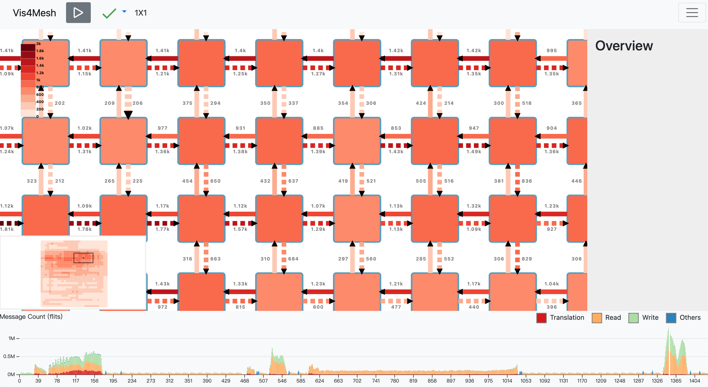

# Vis4Mesh Visualization Tool

Vis4Mesh is a visualization tool for designing mesh Network-on-Chips(NoC) for Wafer-Scale devices, like [Cerebras Wafer Scale Engine](https://cerebras.net/blog/cerebras-wafer-scale-engine-why-we-need-big-chips-for-deep-learning/).

It is mainly assisted with NoC traffic research in [Akita project](https://gitlab.com/akita), also capable for other scenarios to visualize the mesh topology and traffics.

**Notice: This project is still under development, some of the features are not solid. We would update the documents after every new milestone.**

## Motivation

The large scale of the wafer makes it difficult for a designer to get insight into the network behavior simply from the numbers like bandwidth and latency of links. A visualization tool with a view of mixed temporal and spatial statistics would benefit the architects to analyze the performance issues of wafer-scale devices.

After reviewing the existing visualization tool, we found no systematic solution that is directly applicable to visualizing wafer-scale NoC, mainly due to the scalability and unique requirement of NoC. Thus we propose Vis4Mesh with the five key features as follows.

## Feature

1. **Overview of mixed temporal and spatial statistics**

   The temporal view help to distinguish the communication pattern, while the spatial points out the hotspot location in the mesh. We also provide a temporal overview of one switch/channel if you click it, like switch buffer pressure over time.

2. **Sheer scalability to visualize wafers with millions of devices**

   Existing network visualization tools do not consider the scale of wafers with millions of nodes and links. We design the tool targeting large-scale mesh system, using a hierarchy packing and unpacking way to support a smooth and intelligible zoom, with well-optimized rendering performance.

3. **Dynamic player of network-on-chip traffic**

   In pause mode, the tool could display the traffic statistics of any time, and brush a time range to see the details of a stage/pattern.
   In play mode, it would show the dynamic changes of traffic to look at the behavior of the whole or part network.

4. **Flexibility to cluster nodes as a functional module**

   Clustering is quite common in the field of Coarse Grain Reconfigurable Architecture. We propose a flexible way to select nodes in frontend to build a different-sized cluster directly.

5. **Collaboration with another mature visualization tool**

   Akita project already integrates with [Akita Daisen](https://osf.io/73ry8/), a tool for visualizing component-level GPU execution like the request to caches, the process of compute units.
   Vis4Mesh could serve as a supplementary of Daisen to support mesh network traffic visualization that Daisen could not perform very well.

## Design

Briefly, the tool consists of two parts: **Web frontend** and **Server backend**. Frontend only do rendering work, backend feeds the frontend with full graph details through WebSocket.

For details, please refer to [doc/design.md](doc/design.md).

## Installation

## Detached Mode

To use the **frontend**, you can directly access https://vis4mesh.wsyy.me/. The page is built on the latest release. And you can get sample data sets from https://vis4mesh.wsyy.me/resource.

To use the **backend**, you can either use our example server for Akkalat in `src`, or your customized server with port 8080 listened for WebSockets and communication protocol supported. The backend is more complex to run in detached mode, please see [doc/backend.md](doc/design.md) for more details.

## Container Mode

Two docker-compose configurations are provided in [docker-compose.yml](https://github.com/ueqri/vis4mesh/blob/main/docker-compose.yml) and [example/one-key.yml](https://github.com/ueqri/vis4mesh/blob/main/example/one-key.yml). Based on these environments, there are two options to choose respectively.

### Setup server and database in Docker

_Backend server_ and _Redis DB_ are packed into Docker as [docker-compose.yml](https://github.com/ueqri/vis4mesh/blob/main/docker-compose.yml), which make it convenient to build and maintain the backend.

Here we also introduce how to build frontend in the host, if you choose aforementioned online site, just skip the frontend build.

#### Prerequisites

- **frontend**: npm(v8.0+), NodeJS(v16.0+)
- **backend**: docker(v20.0+), docker-compose(v2.0+)

```bash
git clone git@github.com:ueqri/vis4mesh.git
cd vis4mesh
# if you use online site, skip the two `npm` commands
npm install
npm start # run webpack with HTTP server in localhost:1234
docker-compose up # add `-d` to run in background
```

To close the container, use <kbd>Ctrl</kbd> + <kbd>C</kbd> to stop in interactive mode, then `docker-compose down`.

### Setup all components in Docker

Use one-key docker-compose file to set up both **frontend** and **backend** in Docker.

```bash
git clone git@github.com:ueqri/vis4mesh.git
cd vis4mesh
docker-compose -f example/one-key.yml up # add `-d` to run in background
```

Likewise, `docker-compose -f example/one-key.yml down` to close.

## After Setup

If it's all set, just open your favorable browser to view http://localhost:1234/ and see the visualization.

We have provided a demo DB generated by FIR(length:100000) in 8x8 Wafer-scale GPU [akkalat v3](https://github.com/ueqri/akkalat/tree/v3). And all the backend config would be well done by docker-compose.

## Follow-up

As for follow-up work, we'd implemented these features:

- [x] Fine-tune the zoom interaction for large-scale visualization
- [ ] Trace more status data of switch and channels in [Akita Akkalat](https://github.com/ueqri/akkalat) and show in side canvas
- [x] Add minimap for mesh as another spatial overview
- [ ] Build the detailed documents about the design and protocols

## Snapshot of Main Layout



## Reference

[Tutorial on the Akita Simulator Framework and MGPUSim](https://syifan.github.io/akita_hpca2020_tutorial.html)

[GitLab of Akita Simulator Framework](https://gitlab.com/akita)

[Docker Docs: Install Docker Compose](https://docs.docker.com/compose/install/)
